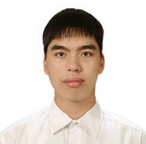
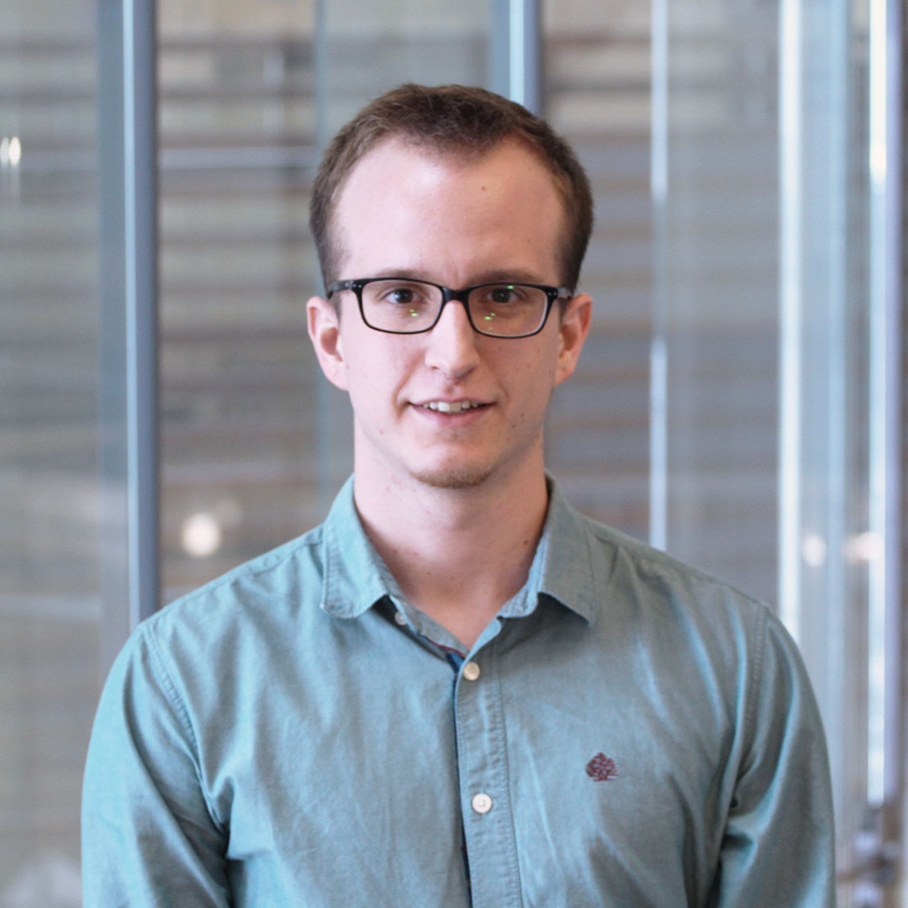
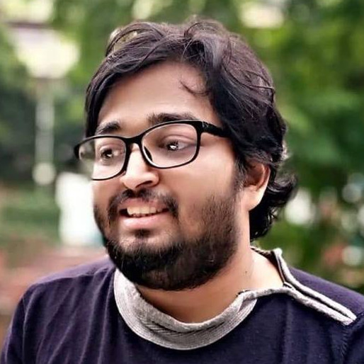
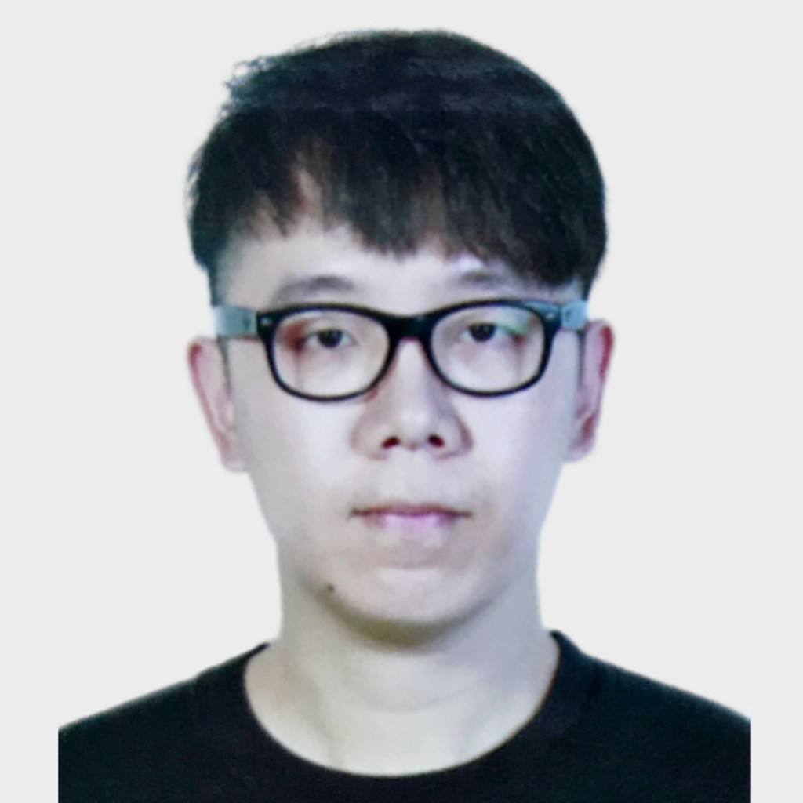

+++
title = "NTU-NLP: Monthly NLP Talks"
date = 2021-06-29
lastmod = 2021-07-05
draft = false

summary = "Series of talks by Singapore NLP/ML enthusiasts."

[header]
image = "headers/hive.jpg"
caption = "Image credit: [**NTU Hive**](https://www.dezeen.com/2015/03/10/thomas-heatherwick-textured-tower-balconies-cpg-consultants-learning-hub-nanyang-technological-university-singapore/)"
+++

The NTU-NLP group will be hosting a series of talks, featuring local NLP researchers and scientists. The seminars will be organized monthly. The goal is to create a platform for local NLP/ML enthusiasts to share their work and to encourage collaborations across local universities and organizations.

Ph.D's, Postdocs, and company scientists are all welcome to participate. **Interested Speakers** please send their inquiry to `ruochen002@e.ntu.edu.sg`.

## Subscription

To subscribe to a mailing list of upcoming talks, please follow either of the steps:

- Please go to [**Google Groups**](http://groups.google.com) and search "ntu-nlp-sg-seminar" under **All groups and messages** tab.

- Email with subject **ntu-nlp-sg-seminar** to `ntunlpsg@gmail.com`.

## Schedule
<!-- ### Time: TBA -->
| 
 Date 
 | 
Description 
|
|:------: | :-----------: |
|            
 12 July, 2021   4:30 - 5:30 PM   (UTC +8) 
 |     Thanh-Tung Nguyen (Thomas)   Ph.D. Candidate, NTU.   [Linkedin](https://www.linkedin.com/in/tungngthanh/) \|  [Google Scholar](https://scholar.google.com/citations?user=NkKC6zYAAAAJ&hl=en) \| [Website](https://tungngthanh.github.io/)   Research topic: Parsing, RNN, Machine Translation   [Talk Details](../../talk/thomas)  [Registration Link](https://teams.microsoft.com/registration/SJPOFSq-K0aPwOF2WpsgSg,mVAApF_uvE2vORk0OJju0w,EfHG1if7WEOly7k9bs3WYQ,FCCJZJ3vzEiY9OmmZMJ9iQ,H0hzNw4NykeFJTivdszM2w,8pP5g8ZiLEaenaJ2y9X3RA?mode=read&tenantId=15ce9348-be2a-462b-8fc0-e1765a9b204a)   <iframe width="560" height="315" src="https://www.youtube.com/embed/HTKIM9_D71I" frameborder="0" allow="autoplay; encrypted-media" allowfullscreen></iframe>|
|            
 16 August, 2021   2:00 - 3:00 PM   (UTC +8) 
 |     Liangming Pan   Ph.D. Candidate, NUS.   [Website](http://www.liangmingpan.com/) \|  [Google Scholar](https://scholar.google.com/citations?user=JcjjOTUAAAAJ&hl=en&oi=ao)   Research topic: Text Generation, Knowledge Graph, Multi-media Learning   [Talk Details](../../talk/liangming)  [Registration Link](https://teams.microsoft.com/registration/SJPOFSq-K0aPwOF2WpsgSg,mVAApF_uvE2vORk0OJju0w,EfHG1if7WEOly7k9bs3WYQ,v1_XYvcKHUiL5HYlH8upQQ,dcx2ACSf_k-3a8mWBEdqgw,gAgX1m0VUEO6SVNHt7wv1g?mode=read&tenantId=15ce9348-be2a-462b-8fc0-e1765a9b204a)  <iframe width="560" height="315" src="https://www.youtube.com/embed/CAJJJOoS-q4" frameborder="0" allow="autoplay; encrypted-media" allowfullscreen></iframe>|

## Organizing Team
<!-- | | | |
| :---: | :---: | :---: |
| |  |  |
| [Shafiq Joty](https://raihanjoty.github.io/) | [Ruochen Zhao](https://www.linkedin.com/in/esther-ruochen-zhao-855357150/) | [Mathieu RAVAUT](https://www.linkedin.com/in/mravox/) |
|  |  |  |
| [Hailin Chen](https://www.linkedin.com/in/chenhailin/) | [M Saiful Bari](https://sbmaruf.github.io) | [Lin Xiang](https://shawnlimn.github.io) | -->

| | | | | | |
| :---: | :---: | :---: | :---: | :---: | :---: |
| |  |  |  |  |  |
| <small> [Shafiq Joty](https://raihanjoty.github.io/) </small> | <small> [Ruochen Zhao](https://www.linkedin.com/in/esther-ruochen-zhao-855357150/) </small>| <small>[Mathieu RAVAUT](https://www.linkedin.com/in/mravox/)</small> | <small>[Hailin Chen](https://www.linkedin.com/in/chenhailin/)</small> | <small>[M Saiful Bari](https://sbmaruf.github.io) | <small>[Lin Xiang](https://shawnlimn.github.io) </small>|

