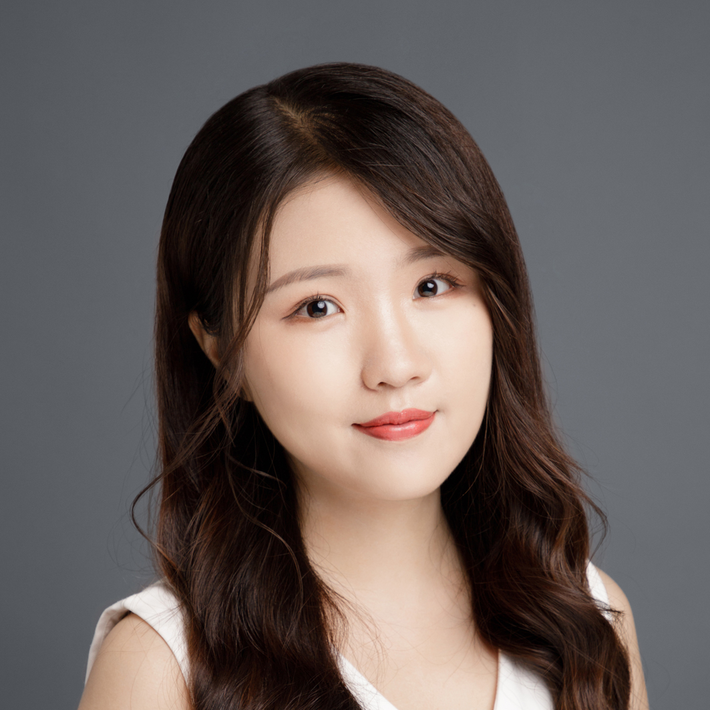
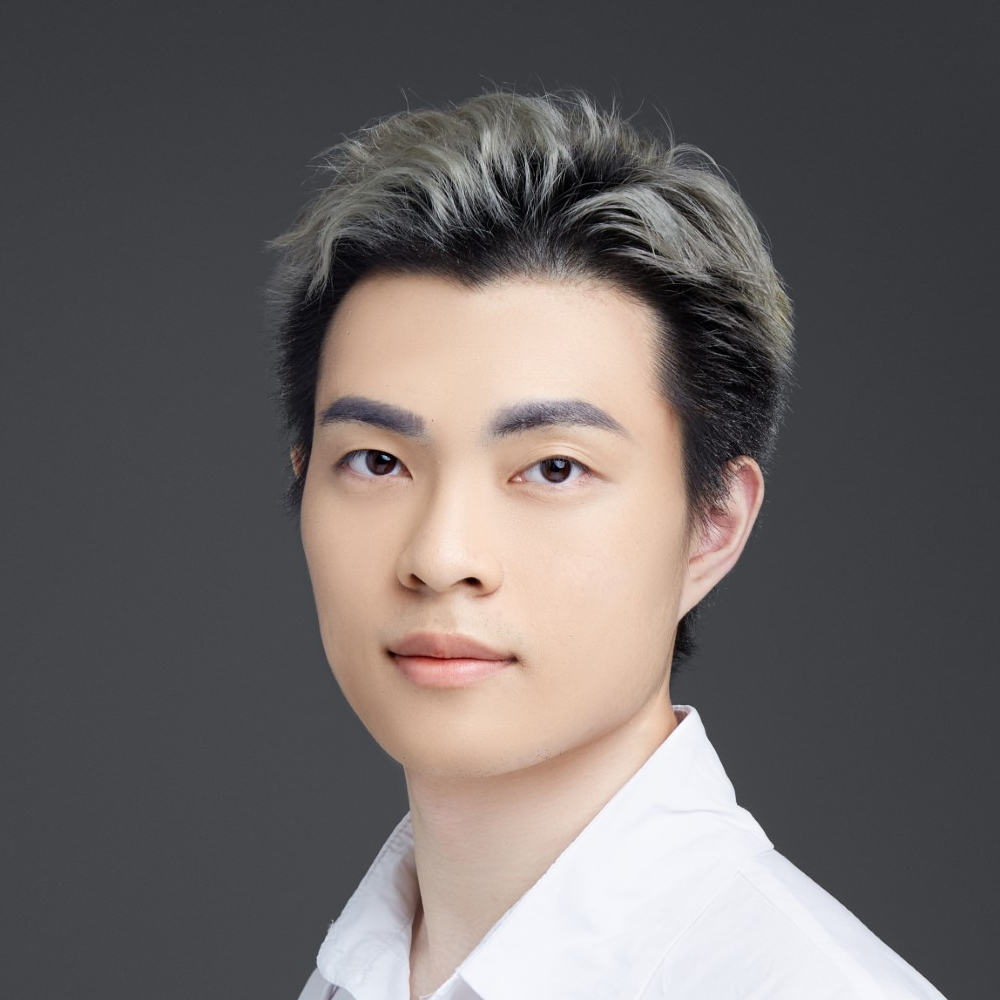

+++
title = "NTU-NLP: Monthly NLP Talks"
date = 2021-06-29
lastmod = 2021-06-29
draft = false

summary = "Series of talks by Singapore NLP/ML enthusiasts."

[header]
image = "headers/hive.jpg"
caption = "Image credit: [**NTU Hive**](https://www.dezeen.com/2015/03/10/thomas-heatherwick-textured-tower-balconies-cpg-consultants-learning-hub-nanyang-technological-university-singapore/)"
+++

The NTU-NLP group will be hosting a series of talks, featuring local NLP researchers and scientists. The seminars will be organized monthly. The goal is to create a platform for local NLP/ML enthusiasts to share their work and to encourage collaborations across local universities and organizations.

Ph.D's, Postdocs, and company scientists are all welcome to participate. **Interested Speakers** please send their inquiry to ruochen002@e.ntu.edu.sg.

### Subscription

To subscribe to a mailing list of upcoming talks, please follow either of the steps:
- Please go to [**Google Groups**](http://groups.google.com) and search "ntu-nlp-sg-seminar" under **All groups and messages** tab.
- Or email with subject **ntu-nlp-sg-seminar** to <ntunlpsg@gmail.com>.

## Schedule
<!-- ### Time: TBA -->
| Date | Description |
| ------ | ----------- |
|   4:30 - 5:30 (UTC +8)   12 July, 2021   |     
 Thanh-Tung Nguyen   Ph.D. Candidate, NTU.   [Linkedin](https://www.linkedin.com/in/tungngthanh/) \|  [Google Scholar](https://scholar.google.com/citations?user=NkKC6zYAAAAJ&hl=en) \| [Website](https://tungngthanh.github.io/)   Research topic: Parsing, RNN, Machine Translation   [Talk Details](../../talk/thomas) |

## Organizing Team
|| | |
|:---: | :---: | :---: |
| |  |  |
| [Shafiq Joty](https://raihanjoty.github.io/)|[Ruochen Zhao](https://www.linkedin.com/in/esther-ruochen-zhao-855357150/)| [Mathieu RAVAUT](https://www.linkedin.com/in/mravox/) |
|  |   |  |
| [Hailin Chen](https://www.linkedin.com/in/chenhailin/)  | [M Saiful Bari](https://sbmaruf.github.io) |[Lin Xiang](https://shawnlimn.github.io)|