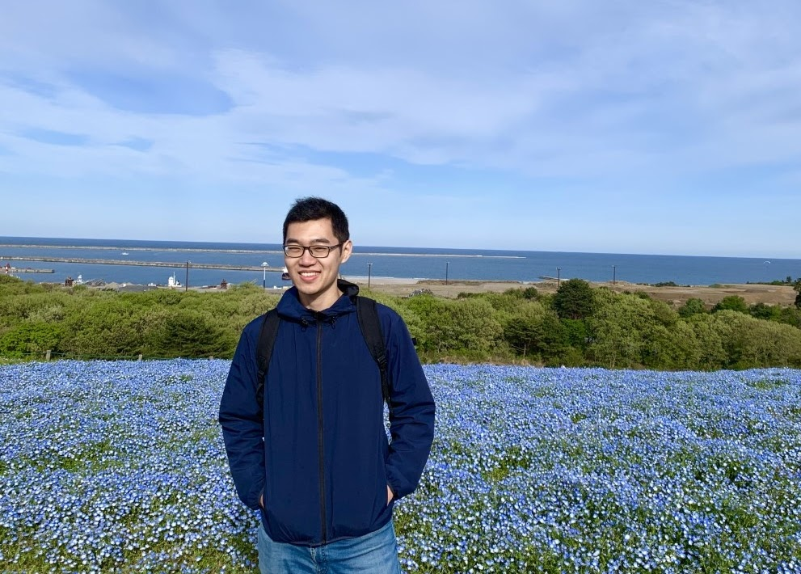

+++
date = 2021-10-03T00:00:00  # Schedule page publish date.
title = "Representation learning with few human annotations"
time_start = 2021-10-11T16:30:00
time_end = 2021-10-11T17:30:00
abstract = "Representation learning has been the key factor of success for many deep learning models. While conventional representation learning relies on a larger amount of human-annotated data, learning without human annotation has become the modern trend. In this talk, I will introduce three directions to advance representation learning with few human annotations, namely (1) self-supervised learning, (2) semi-supervised learning, and (3) webly-supervised learning. (1) and (2) will focus on the vision domain, whereas (3) will focus on vision-language understanding."
event = "NTU-NLP: Monthly NLP Talks"
event_url = ""
location = "Teams Meeting"

# Is this a selected talk? (true/false)
selected = false

# Projects (optional).
#   Associate this talk with one or more of your projects.
#   Simply enter the filename (excluding '.md') of your project file in `content/project/`.
# projects = ["NLP"]

# Links (optional).
url_pdf = ""
url_slides = ""
url_video = ""
url_code = ""
project=""
# Does the content use math formatting?
math = true

# Does the content use source code highlighting?
highlight = true

# Featured image
# Place your image in the `static/img/` folder and reference its filename below, e.g. `image = "example.jpg"`.
[header]
image = "headers/bubbles-wide.jpg"
caption = ""

+++

**Speaker:** 

   
 Junnan Li   Senior Research Scientist, Salesforce Research Asia, Singapore   [Website](https://sites.google.com/site/junnanlics) \|  [Google Scholar](https://scholar.google.com/citations?user=MuUhwi0AAAAJ&hl=en&oi=ao)   Research topic: Self-supervised Learning, Semi-supervised Learning, Weakly-supervised Learning, Transfer Learning, Vision and Language   [Registration Link](https://teams.microsoft.com/registration/SJPOFSq-K0aPwOF2WpsgSg,mVAApF_uvE2vORk0OJju0w,EfHG1if7WEOly7k9bs3WYQ,0yaa_CtqpkmQRFdwoSF_TA,qy_q0roFTkGX10G2Zo7mPg,sUdmKIvuBkqsqwmxDcrTJQ?mode=read&tenantId=15ce9348-be2a-462b-8fc0-e1765a9b204a)

**Bio:** Junnan Li is currently a senior research scientist at Salesforce Research Asia. He obtained his PhD at the National University of Singapore in 2019. He has published in many top-tier venues in machine learning and computer vision, such as NeurIPS, ICLR, CVPR, ICCV, etc. His main research interests include self-supervised learning, semi-supervised learning, weakly-supervised learning, and vision-language learning. His ultimate research goal is to build general-purpose models that can self-learn without human involvement.
